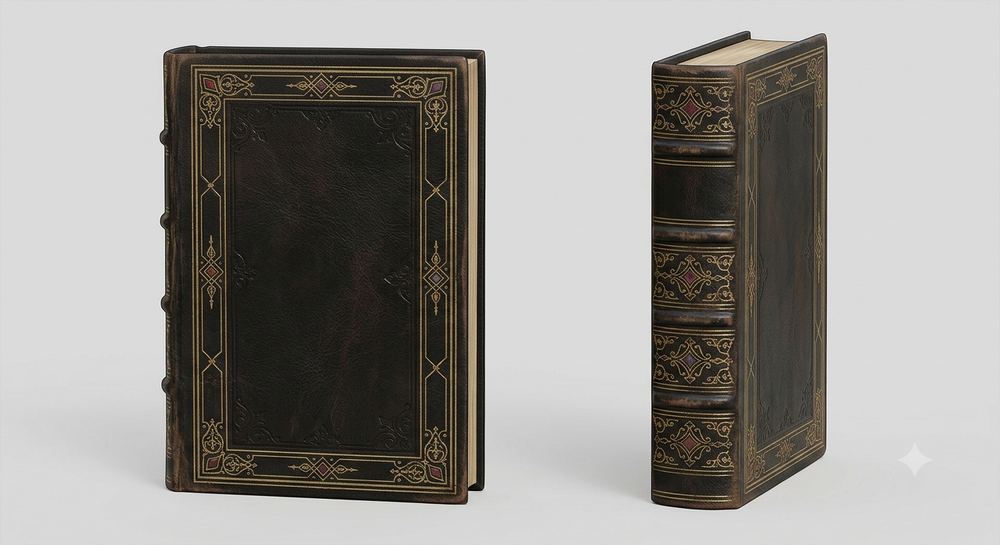

# Boken
En normalstor bok bunden i läder med förgylld intarsia. Varken pärmen eller ryggen har någon text skriven på sig. Stilen på bindningen är från sent 1800-tal. Innehållet i boken är en uppsättning ritualer, formler och sigill som dess ägare kan använda sig av tack vare pakten med [entiteten](/knowledge/demon.md). Boken är ett fysiskt objekt, det är inget magiskt över den utöver att den är övernaturligt tålig. Detta innebär att den kan stjälas eller glömmas, men den kan inte användas av någon som inte ingått pakten. 

Boken i sig är inte nödvändig för att genomföra något av det som står i den, utan den fungerar mer som ett uppslagsverk. Instruktionerna i den är dock väldigt detaljerade och i många fall invecklade och minsta lilla misstag gör att entiteten inte är bunden att ge någon effekt.

Större delen av boken är skriven på gammaldags engelska, men ju längre bak i den man läser, desto modernare blir språket. Allt är ändå skrivet på engelska. Allt i den är skrivet och tecknat för hand. De nyare styckena innehåller förtydliganden och annat som tidigare ägare tyckte var relevant att skriva ner, dock inget personligt om dem själva.

Boken är inte bunden till pakten, annat än att den nedtecknades först av den första personen som ingick pakten, som en del av den. Dess tåligheten är likaså en konsekvens av pakten, ett sigill är inbakat i bindningen. 

## Innehåll vid start
### Sigill
- Sigill som varningssystem — appliceras innan hon sover eller lämnar en plats, varnar henne om någon kommer nära (nämnt flera gånger, bland annat vid rummet i akt 1 och senare i akt 2).
- Sigill hon applicerar på sig själv inför uppdrag — nämnt i akt 1 ("applicerar ett antal sigill på sig själv") innan hon ger sig av mot Haralds bostad. Oklart vad de gör konkret — skydd? förstärkning? spårning av målet?
- Skydd (för klienter) — nämnt som tjänst, aldrig konkretiserat.

### Ritualer
- Något för att lokalisera mål — hon "använder sig av det hon fick från Harald för att veta var han finns", vilket antyder en ritual kopplad till spårning via en fysisk beståndsdel (hår, blod, personligt föremål) från målet.
- Återupplivande — nämnt som en möjlig tjänst ("eventuellt"), aldrig sett i praktiken.
- Helande — nämnt som en av hennes tjänster, aldrig sett i praktiken än i skisserna.
- Skydd (för klienter) — nämnt som tjänst, aldrig konkretiserat.

### Trollformler
- Förmågan hon använder mot vakten/vakterna i akt 2 — påverkan/övertalning av något slag, för att bli släppt.
- Förmågan hon använder mot Viktor i konfrontationen i akt 2 — något offensivt, tillräckligt kraftfullt för att ge honom "större förståelse för hur farlig hon kan vara", men inte tillräckligt för att besegra hela hans grupp av hantlangare.

## Tillägg i akt 2
De nya sakerna från entiteten — "behövs för att skydda dem båda" i valvscenen, ännu odefinierat vad de faktiskt gör.

## Frågor
- Finns det ritualer i boken hon ännu inte använt, eller inte vågat använda?
- Vill du ha en tydlig kategorisering i boken (t.ex. attack/skada, skydd, perception/påverkan, spårning, helande/liv-död), eller ska det kännas mer organiskt och blandat, som en verklig ockult samlingsbok skulle vara?
- Skalar kostnaden (blod) ungefär linjärt med effekten (mer blod = mer kraftfull effekt), eller finns det ritualer som är "dyra" av andra skäl (svårighetsgrad, risk, tid) snarare än ren blodmängd?
- Ska några ritualer kräva andras blod specifikt (inte bara hennes eget) för att fungera, vilket skulle förklara varför hon ibland behöver klienter eller offer närvarande snarare än att bara klara sig med sitt eget?
