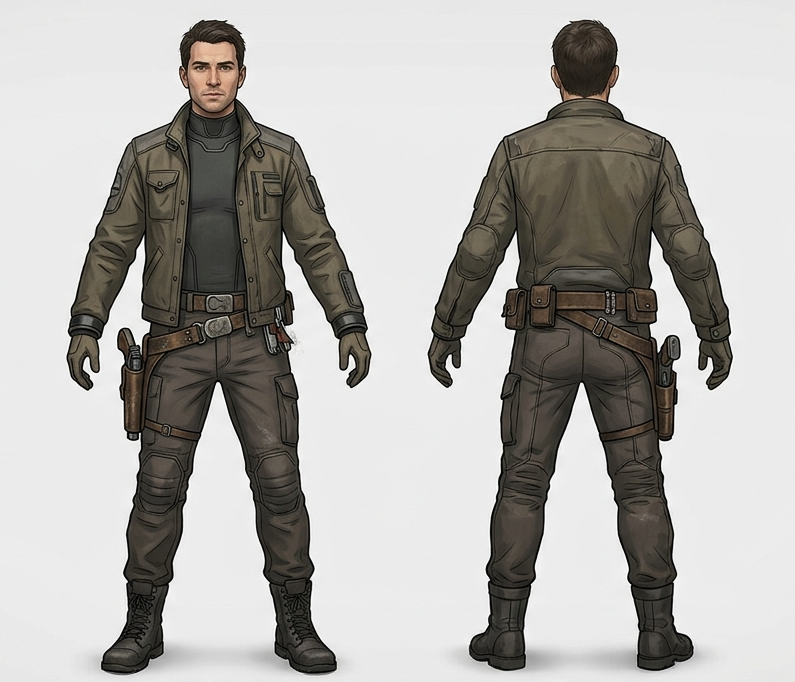

# Erik - Uppdragsgivaren
Erik är omkring 30 år och skulle nog beskriva sig själv som en äventyrare men är mer av en smugglare eller någon som söker upp saker åt andra. Det han gör är inte helt olikt [Nora](/knowledge/nora.md) även om hans tillvägagångssätt och vad han kan göra är mer konventionellt. Hans arbete må vara åt det ljusskygga hållet, men hans moral är ändå såpass stark att han inser att det [Harald](/knowledge/harald.md) håller på med inte kan fortsätta.

Han är normalbyggd men kort, mer åt det smidiga hållet. Han har kortklippt mörkbrunt hår. Han klär sig i en neutral figursydd dräkt, tätt åtsittande kring hals, handleder och vrister med praktiska kläder ovanpå, byxor och jacka. I bältet har han ett par mindre väskor och vid ena höften en pistol.

Han undviker helst att använda våld, men vet hur han ska använda sitt vapen.

Omkring ett år innan mordet på Harald insåg han vad hans dåvarande arbetsgivare var ute efter. Han arbetade inte direkt för Harald, men var involverad i sökandet efter den [gömda utomjordiska teknologin](/knowledge/iris.md#varför-hon-är-viktig). Han grävde vidare i det på egen hand och upptäckte bombningen av barndomshemmet och kopplingen till Harald. Att kontakta Iris var lite av en chansning, men hon dök upp i Haralds familj kort innan dess så hon var den rimliga bakgrunden.

Erik vet inte heller hur Iris hänger ihop med gömman, bara att det finns en koppling.

Han har en hel kontakter i den undre världen och några som rör sig i gränslandet. Många av dessa brände han genom att agera på eget bevåg och söka upp Iris.

## Frågor

#karaktär