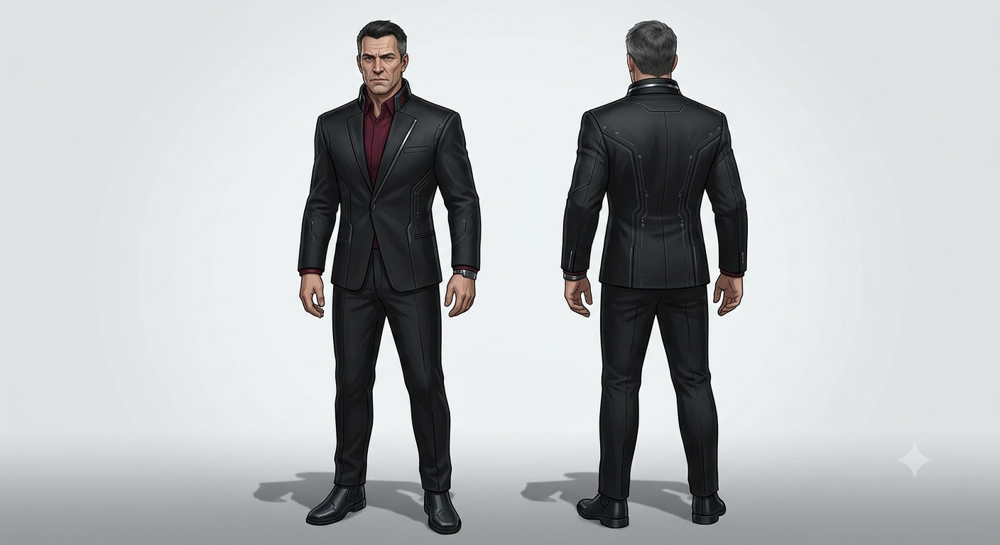

# Harald Ek
Harald Ek var 52 år när han dödades av [Nora](/knowledge/nora.md). Han var lång och kraftig, stark, med kortklippt svart hår och ett hårt ansikte. Han klädde sig oftast i svart kostym, gärna med vinröd skjorta, men utan några utsmyckningar. Han var mycket välutbildad och väldigt intelligent.

Harald är mycket förmögen och inflytelserik, två saker som går hand i hand. Han rör sig obehindrat i de övre skikten på bägge sidor av lagen.

Han har under lång tid varit näst intill besatt av ryktena kring undangömd [utomjordisk teknologi](/knowledge/iris.md#varför-hon-är-viktig) och har spenderat mycket resurser på att verifiera olika spår. Detta ledde honom till slut till [Iris](/knowledge/iris.md) då han genom olika delar av sitt nätverk lyckades spåra hennes ursprung till en person som han var säker på var grunden till många av ryktena. Någonstans i detta nätverk finns [Erik](/knowledge/erik.md), inte som en direkt kontakt utan som en mellanhand. 

Harald adopterade medvetet Iris från barnhemmet efter att han upptäckt hennes ursprung. Det gick dessutom väl ihop med hans frus önskan om en dotter. Frun har sedan dess gått bort. Han ville komma åt Iris för att utnyttja henne för sin familjs vinning.

Harald såg till att visa kärlek till Iris, mycket för att dölja sina egentliga syften. Han ville inte att hon skulle se skillnad på hur han behandlade henne och [Viktor](/knowledge/viktor.md). Mot Viktor var kärleken han visade äkta, likaså mot sin nu döda fru.

Han låg också bakom att striderna rörde sig mot barnhemmet, för att sopa undan alla spår av Iris och adoptionen. De enda som känner till hennes ursprung är hon själv och resten av familjen. Harald trodde att han lyckades med sin plan, barnhemmet brann ner och inga överlevande återfanns på platsen. Han känner inte till att [Nora](/knowledge/nora.md) överlevde. Han känner inte heller till Erik eller att han har kontakt med Iris. Ur Haralds synvinkel går allt enligt planerna fram till att han mördas.

Precis innan sin död fick han kännedom om var Iris förfader gömde teknologin. Detta var också orsaken till att han mördades. Vad varken han eller Viktor upptäckt än är hur Iris är användbar för att öppna valvet.

Haralds familj kommer från gamla pengar. Familjen har drivit olika verksamheter över många hundra år, både lagliga och olagliga och har under större delen av den tiden varit mycket inflytelserik.

## Frågor
