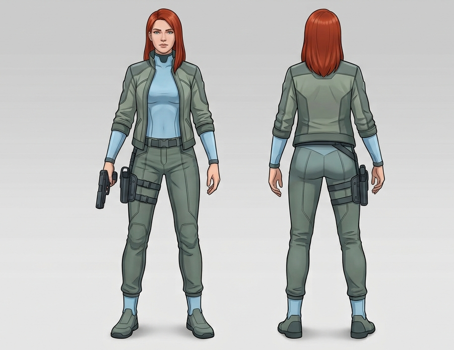

# Iris
Iris är ungefär jämngammal med [Nora](/knowledge/nora.md), endast några månader yngre. Hon kom till barnhemmet några år efter Nora, när de bägge var omkring 11, 12 år. De blev snabbt nära vänner där. Ungefär sex månader innan barnhemmet brann ner adopterades hon till en inflytelserik familj bestående bland annat av [fadern](/knowledge/fadern.md) och [sonen](/knowledge/sonen.md). Familjen önskade sig en dotter, och visste att Iris hade en koppling till något viktigt (härkomst som ger tillgång/arv/rättigheter till något viktigt, kraftfullt eller värdefullt).

Relationen till Nora var endast väldigt nära vänskap. De stod varandra nära ända tills Iris adopterades. När hon adopterades bort raserade relationen eftersom Nora såg det som ett svek, vilket Iris inte förstod. Iris å sin sida blev arg över att Nora inte kunde vara glad för hennes skull. Hon har inte helt förlåtit Nora, men har inte heller ägnat henne några större tankar de senaste åren. Hon känner inte igen Nora när hon upptäcker henne i sitt hem.

När hon kom till familjen förändrades hennes förutsättningar till det bättre. Familjen gav henne allt hon behövde i form av resurser och utbildning, utan att skämma bort henne. Åren efter barnhemmet präglades av trygghet. De undanhöll dock mycket av familjens verksamhet och varför hon adopterats. 

Relationen till sonen var vänskaplig under flera år, men det är numera en fasad hon försöker upprätthålla. Relationen till övriga familjemedlemmar följer samma mönster, fram tills nyligen var den kärleksfull.

Någon gång under det senaste året blev hon kontaktad av [uppdragsgivare](/knowledge/uppdragsgivaren.md) som berättade om hennes ursprung och varför familjen adopterat just henne. Hon tvivlade till en början, men nyfikenhet fick henne att undersöka saken själv och till slut förstod hon att uppdragsgivaren hade rätt. De planerade tillsammans hur hon skulle kunna ta sig från familjen, vilket ledde fram till att uppdragsgivaren lejde Nora. Iris kände inte till mordplanen. Vad Iris och uppdragsgivaren vet om hennes betydelse är inte hela bilden.

Iris längre och kraftigare än genomsnittet, familjen har sett till att hon håller sig i form. Hon har axellångt rött hår. Efter flykten från hemmet klär hon sig funktionellt, ljusblå figursydd dräkt som är tät kring hals, handleder och vrister. Över det funktionella byxor och och jacka i dämpad grönt och grått. Vid ena höften bär hon en pistol.

Hon har ingen träning i att använda en pistol, men har generell kunskap om hur det används då hon sett liknande vapen användas i olika medier, till exempel nyheter eller filmer. Hon vet hur den används, men förstår inte fullt ut vad det innebär i form av tex rekyl. Det vapen hon bär nu införskaffade hon inför flykten från familjen.

Iris är utåtriktad och nyfiken, kanske lite naiv men mycket av det krossades när hon förstod vad hennes familj ville ha ut av henne. Hon är inte rädd för att säga vad hon tycker om saker, men uttrycker sig inte vulgärt.

## Frågor
- Varför är Iris viktig?
  - Biologisk/genetisk koppling – något i hennes blod eller ursprung som är värdefullt eller farligt (kanske till och med kopplat till entiteter/paktvärlden i stort, vilket skulle kunna knyta ihop det övernaturliga elementet med huvudplotten på ett elegant sätt).
  - Arv eller rättighet – hon är kopplad till något fadern förvärvat olagligt/omoraliskt (mark, ett företag, en titel) och adoptionen var ett sätt att kontrollera eller neutralisera ett anspråk.
  - Kunskap hon bär utan att veta om det – något hon sett, hört, eller ärvt information om från sina biologiska föräldrar, som fadern behövde säkra genom att ha henne nära.
  - Hon är inte det egentliga målet, utan en nyckel till någon annan – kanske en biologisk förälder som fadern var i konflikt med, och henne som adoptivdotter var ett sätt att hålla ett finger på den relationen.
