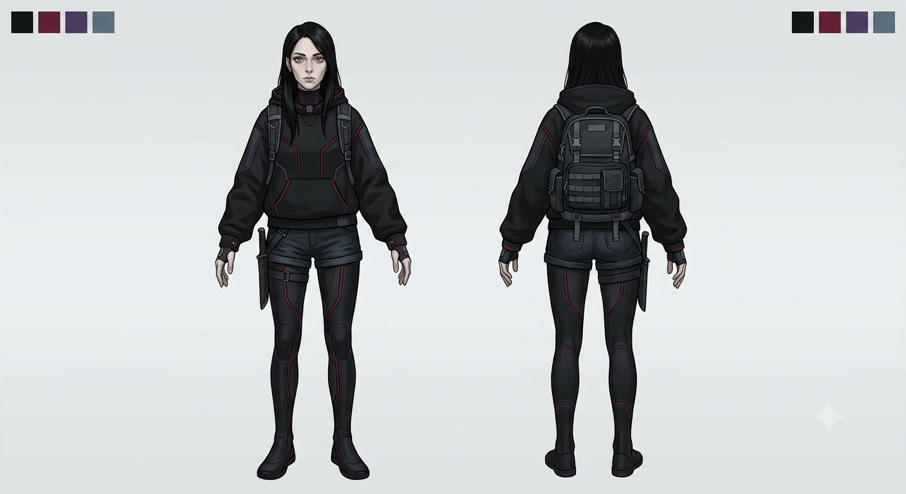

# Nora
Kvinna, 22 år. Långt svart hår, gröna ögon, tanig, blek. Klär sig i svart, rött och lila. Använder gärna huvtröjor och jeansshorts över en figursydd dräkt. Dräkten har integrerade kängor och är tätslutande kring hals och handleder. Dräkten är specialanpassad för hennes behov, vid handlederna kan den tappa blod från henne. Hon bär en ryggsäck i vilken hon har sin bok och annat hon behöver för ritualerna, till exempel ljus, kritor, skålar och mortel. I ryggsäcken bär hon också sina övriga, mer normala ägodelar. Vid höften bär hon en enkel kniv, den är funktionsduglig och välbalanserad.

Hon är amoralisk och ställer sig likgiltig inför andra. Hon använder sig av sina förmågor för att tjäna pengar, för att överleva. Hon är intelligent och ser till att hon alltid får ut mer än bara pengar för sina tjänster. Hon säljer skydd, information, mord, helande och eventuellt återupplivande. Utöver pengar tar hon betalt i kunskap, information och sex — sådant som kan ge henne hållhakar på mäktiga personer. Det ger henne skydd. Hon är kraftfull i sig själv, men inte obegränsat; skulle till exempel lokal polis eller militär rikta in sig på henne kan hon inte hantera hur mycket som helst på samma gång.

Vid något tillfälle för ungefär fem år sedan kom hon i kontakt med en [entitet](/knowledge/demon.md) som hon slöt en pakt med. Hon fick en bok med formler och ritualer, med strikta regler för hur de genomförs. Entiteten får blod, både hennes eget och hennes klienters, i utbyte. Reglerna och ritualerna är egentligen helt arbiträra — saker entiteten hittat på, dels för sin egen underhållnings skull, dels för att begränsa kvinnan. Hon får till exempel inte dra för mycket blod från sig själv, för att inte riskera sitt liv. Hon vet inte exakt vad entiteten är. Pakten kan brytas, men det kräver att någon annan tar över den; hon har inget intresse av att bryta den.

Det som hände för fem år sedan skedde av desperation. Hon var utsatt, på gränsen till svält. Pakten räddade henne. Innan dess bodde hon på ett barnhem. Hennes taniga, bleka utseende är en kombination av det förflutna och av att hon ständigt använder sitt eget blod.

Hon lämnade barnhemmet som 16-åring då det brann ner, vad hon själv vet överlevde ingen annan. Branden i sig orsakades av en konflikt som spred sig till barnhemmet. På barnhemmet höll hon sig mest för sig själv, men kom en annan [flicka (Iris)](/knowledge/iris.md) nära under några år. Denna vän lämnade barnhemmet några år innan branden, enligt vad som sades adopterades hon. Nora själv upplevde det som ett svek, hennes enda vän lämnade henne kvar.

Nora reser mellan planeter och rymdstationer, hon håller sig i rörelse då hennes tjänster inte sällan drar till sig uppmärksamhet hon inte vill ha. Ett visst mått av rykte ser till att odla ändå, så att folk som vill köpa hennes tjänster ändå söker upp henne. Hon sprider information om vart hon varit och vart hon kan tänkas ta sig härnäst genom olika ljusskygga informationskanaler. Väl på en ny plats hittar hon billiga hotell eller liknande där hon hyr rum, varifrån hon opererar. Tjänsterna i sig kan utföras där eller på en annan plats.

Nora dricker mycket kaffe, minst tre koppar om dagen, oftast mer. Mat äter hon när hon blir hungrig, det är sällan ett problem för henne att få tag på. Ätbara saker är en del av betalningen från hennes klienter, det behövs för att hålla blodsockret uppe. Hon ser till att sova ordentligt, något hon oftast kan göra tack vare blodsigill som varnar om någon kommer nära.

Hon är rädd för eld, något som kommer ur branden som förstörde barnhemmet. Hon hyser också en viss rädsla eller avsky mot våldsmakt, polis, militär och andra som använder våld för att upprätthålla makt, oavsett som den är laglig eller inte.

Hon bryr sig, i grunden, bara om sig själv. Pakten och hur reglerna ser ut gör att hon ser på sin kropp mer som ett verktyg för att hon ska överleva. Hon äcklas inte av sig själv, men ser sig själv mest som något funktionellt.

## Pakten
Se [pakten](/knowledge/pakten.md)

## Frågor
**Om kvinnan**
- Har hon någon rutin eller något ritualbeteende utanför själva ritualerna (hur hon äter, sover, håller sig frisk trots blodförlusten)?
- Finns det något hon är rädd för?
- Har hon några begränsningar i sina förmågor utöver blodgränsen — saker hon inte kan göra, eller inte får göra enligt boken?
- Har hon gjort något hon själv skulle kalla ett misstag, även om hon inte ångrar det moraliskt?
- Vet hon vad vännen hette, eller hur hon ser ut idag — skulle Nora känna igen henne om de möttes igen?
- Är "sveket" något Nora medvetet håller kvar som bitterhet, eller mer något hon tryckt undan och slutat tänka på (tills något i handlingen river upp det)?

#karaktär