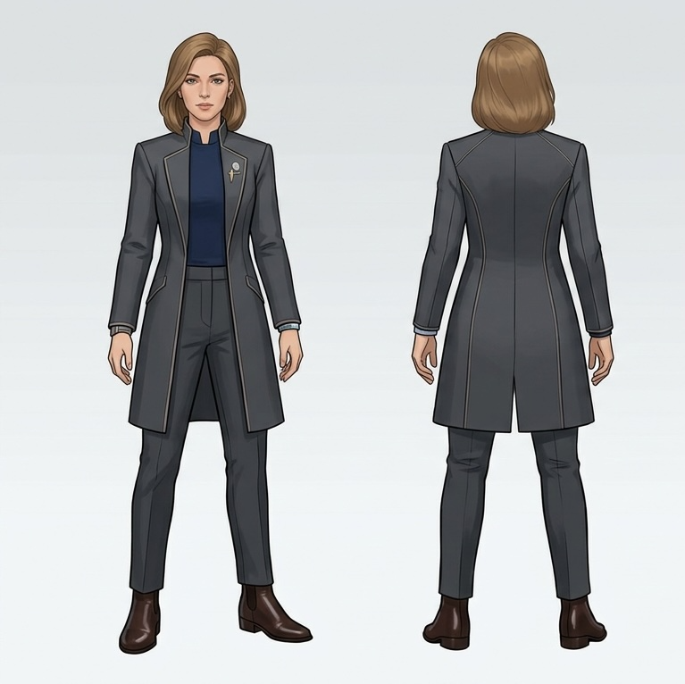
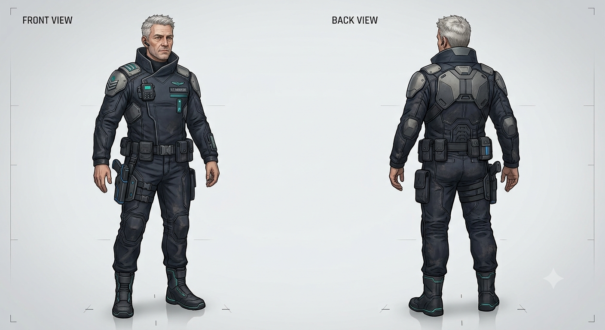

# Sidokaraktärer
## Elin Sparre - Första klienten
Kvinna, omkring 30. Arbetar inom finansbranschen, tidigare vid en större bank i systemet (inte bara på stationen). Vill nu bli frilansare och har därför sökt upp Nora för att förbättra sina chanser. Är något vidskeplig, hon tror mer på ritualerna i sig snarare än att de har en faktisk effekt. Har på sitt tidigare jobb kommit över information om transaktioner mellan en lokal kriminell organisation och flera poliser på stationen, något hon använder som betalning. Klär sig i vad som närmast kan beskrivas som en kostym - byxor, blus, kavaj - i futuristisk stil.

Namnet är en (lite konstlad) referens till att spara.

## Anders Sund - Polisen
Kommissarie, ansvar för kontakt med hamnarna på stationen. Omkring 50, korrupt. Tillräckligt högt uppsatt för att kunna utnyttjas i den här situationen, men inte så pass att han kan riskera Noras flykt från stationen. Kan komma åt övervakningsfilmer, loggar över passager och så vidare.

Han är köpt av en lokal kriminell organisation vilket ger Nora en hållhake på han. Så pass insyltad vid det här laget att om det kom ut skulle det riskera hans liv (genom de kriminella) eller fängelse. Stor risk finns även för hans familj.

Känner inte till Nora personligen, men har ändå hört rykten. Hotet från Nora, som har verifierbar information om hans korruption, gör att han går med på att ta fram den information som Nora behöver.

Namnet är något ironiskt då Anders är korrupt.

## Mikael Ström - Hamnarbetaren
Man, runt 45 år. Arbetar med administration, lastlistor, dockningslistor, avgångar och ankomster och så vidare. Inte särskilt fysiskt stark, men observant och ganska intelligent. Bra på att hantera situationer som uppstår kring skeppen som använder hamnen, och deras besättningar. Ganska medveten om sina egna brister och styrkor.

Han är gift, har en familj och försöker därför hålla sig utanför de konflikter som ofta uppstår på stationen. Han handskas dock ofta med människor som har mindre ärliga syften, genom sitt arbete, och har därför lärt sig att känna igen personer som kan vara farliga.

Han känner inte till Nora sedan innan, men uppfattar direkt att Nora är farlig. Det gör honom vaksam, och beredd att göra som hon säger. Kombinationen av hans insikter, skamkänslor över dessa och Noras agerande gör att han bestämmer sig för att ta fram den information hon letar efter.

Namnet är en referens till hamnar, genom vatten.

