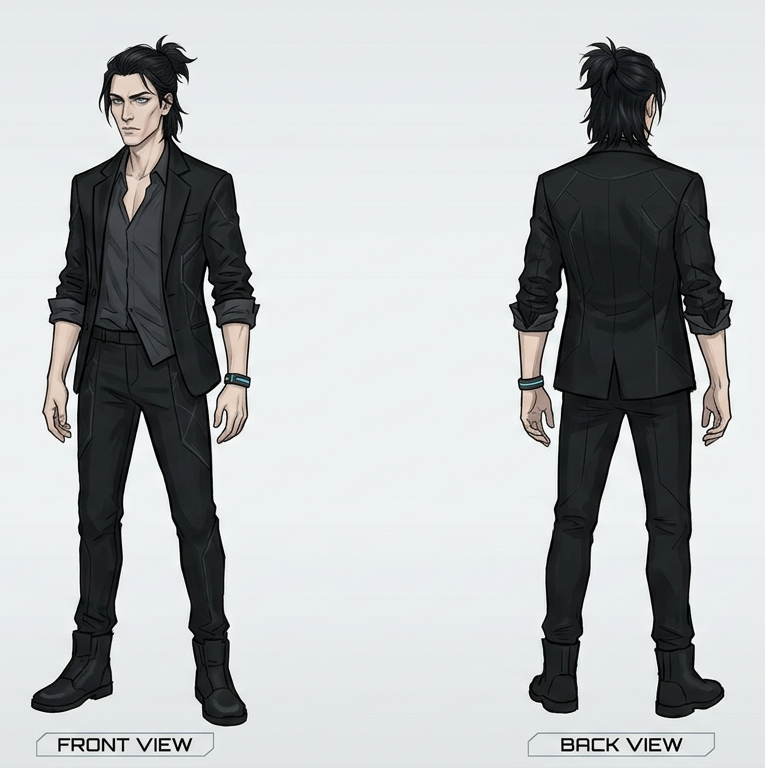

# Viktor Ek
Viktor är 27 år. Han är tunn, något han tar efter sin mor, men med sin [fars](/knowledge/harald.md) svarta hår. Han har halvlångt hår som han föredrar att knyta upp i en kort tofs. Hans ansikte är spetsigt med intensiva ögon. Precis som sin far klär han sig i svart kostym, men inte med samma enkelhet eller stil. Ofta är kostymen oknäppt och skjortan under uppknäppt i halsen.

Precis som sin far och [Iris](/knowledge/iris.md) är han välutbildad, men inte fullt så intelligent som Harald. Han är impulsiv och hade föredragit att Haralds plan rörde sig snabbare. Han såg däremot upp till honom, men ser ändå hans död som en möjlighet att göra saker på sitt sätt. Sörja honom kan han göra senare när han hämnats på [Nora](/knowledge/nora.md).

Han är väl införstådd med Iris betydelse och Haralds planer för henne. Utöver det var deras relation god och syskonlik, han har svårare att separera henne från familjen än vad Harald hade. Nu när fadern är död är hans mål att fullfölja planerna snabbare än vad Harald tänkt sig.

Sedan Haralds död är han familjens överhuvud med allt vad det innebär, tillgång till deras förmögenhet och andra resurser i form av industri, kontakter, personal och utrustning.

Viktor kände inte till att Iris visste vad de planerade när Harald dog. Eftersom han aldrig såg [Erik](/knowledge/erik.md) lämna hemmet med Iris vet han inte mycket mer nu, det enda han vet är att fadern är död och Iris är försvunnen och Nora var den enda kvar i bostaden.

## Frågor
